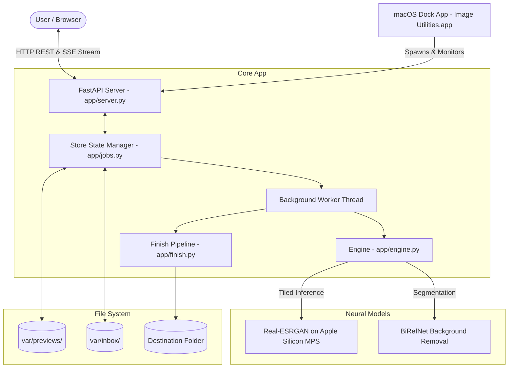
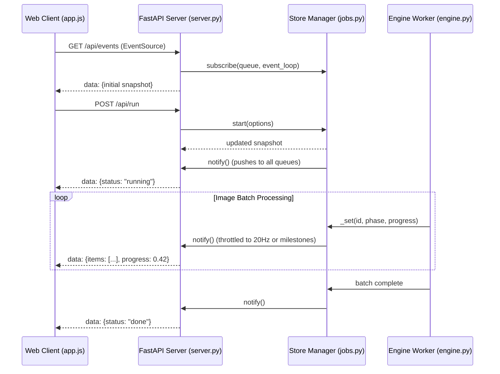
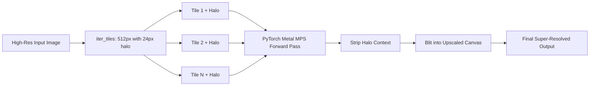
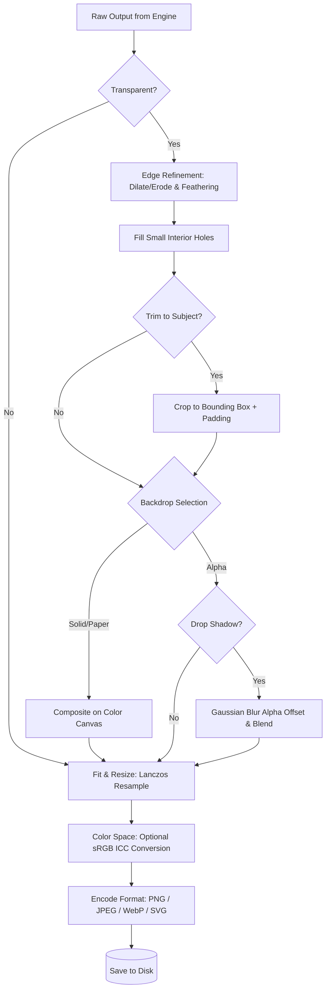

# Image Utilities — Architecture & Technical Specifications

This document details the internal architecture, threading model, neural network execution pipeline, real-time event streaming, and user interface systems of **Image Utilities**.

---

## 1. System Architecture

The application is structured into four decoupled layers:
1. **Host Environment & Lifecycle**: Native macOS AppKit wrapper (`mac/main.swift`) that manages process launch, logging, signal handling, and Dock integration.
2. **Server & Communication**: FastAPI application providing REST endpoints, file dialog bridges, and Server-Sent Events (SSE) for low-latency progress push.
3. **Queue & Job Store**: Thread-safe batch execution queue (`app/jobs.py`) coordinating preview caching, state snapshots, and asynchronous worker execution.
4. **Execution Engine & Finish Pipeline**: PyTorch Metal (MPS) neural upscaler, BiRefNet segmentation model, and PIL-based image finishing algorithms.



---

## 2. Real-Time Event Streaming (SSE)

Rather than having the frontend poll `/api/state` on an interval, the application implements a **Server-Sent Events (SSE)** architecture:



- **Subscription Management**: When a client opens `/api/events`, an `asyncio.Queue` is bound to the server's event loop and registered with `Store`.
- **Thread-Safe Notification**: When worker threads update batch state, `Store.notify()` broadcasts the JSON snapshot thread-safely via `loop.call_soon_threadsafe(queue.put_nowait, payload)`.
- **Throttling & Milestones**: Continuous fractional progress updates are throttled to a maximum of 20 updates/second to avoid flooding the browser event loop, while lifecycle milestones (queued, running, done, error, cancel) are delivered immediately.

---

## 3. Neural Processing & Tiled Inference Engine

### Model Roster
| Task | Target | Architecture | Weights File | Resolution Factor |
| :--- | :--- | :--- | :--- | :--- |
| **Photo Upscale** | Photos, real-world textures | Real-ESRGAN | `RealESRGAN_x4plus.pth` | 4× |
| **Photo 2×** | Compact super-resolution | Real-ESRGAN | `RealESRGAN_x2plus.pth` | 2× |
| **Art / Anime** | Line art, illustrations, UI | Real-ESRGAN Anime 6B | `RealESRGAN_x4plus_anime_6B.pth` | 4× |
| **Cutout** | Background removal | BiRefNet | Cached by `rembg` | 1× |

### Overlapping Tile Algorithm (`app/tiles.py`)
Neural upscaling high-resolution images (e.g. 24–100 MP) in a single pass can easily exceed VRAM limits on unified memory devices. The engine tiles large inputs into overlapping windows:
1. The image is subdivided into overlapping tiles (default: 512×512 window with a 24px blend margin).
2. Inner rectangles partition the canvas such that each pixel is uniquely assigned to a single output tile.
3. The overlapping halo context is fed to the convolutional layers, avoiding boundary artifacts or edge seams.
4. Tiles are stitched sequentially onto the final target canvas.



---

## 4. Canvas & Matte Pipeline (`app/finish.py`)

When an image completes neural inference, it transitions through the `finish_image` pipeline:



---

## 5. Frontend UI/UX Architecture

The user interface is built on modern Web standards with zero external JS/CSS dependencies:
- **Design Tokens**: Defined in CSS variables (`--bg-app`, `--bg-panel`, `--accent`, `--border-subtle`) supporting macOS Dark & Light modes with instant runtime toggle.
- **Adaptive Zero-Scroll Direct Inspector**: Replaces nested scrollbars and disjointed tabs with a clean, task-adaptive layout. Selecting a task (Background Removal, Upscale, Both, Resize, Convert, Rename) immediately exposes all relevant controls on a single, visible surface without ghost scrolling:
  - `Scale Factor & Model Look`: Photo vs Art/Anime presets in compact paired rows.
  - `Finished Size`: Keep current size, long edge, width, height, or bounding box with dimension guards.
  - `Edge Quality & Matte`: Real-time hole filling, padding, drop shadow, and alpha/paper/custom hex backdrop.
  - `Export Format`: Instant PNG, JPEG, WebP, SVG, and sRGB toggles.
  - `Collapsible File Naming`: Expandable details element for prefix, suffix, find/replace, and numbering.
- **Pro Comparison Studio**:
  - **Curtain Split**: CSS clip-path dynamically driven by an interactive grab handle.
  - **Side-by-Side**: Synchronized dual-canvas layout for widescreen displays.
  - **Peek Original**: Real-time opacity toggling on mouse-down or <kbd>Spacebar</kbd>.
  - **Backdrops**: Dynamic checkerboard and solid color classes on `#frame`.
- **Multi-Selection Controller**: Tracks a `Set<string>` of selected IDs, rendering a floating action bar for bulk operations.

---

## 6. Directory Layout & Runtime Files

```
var/
├── app.pid           # Active process ID of Uvicorn server
├── app.url           # Active local server URL (e.g. http://127.0.0.1:8765)
├── settings.json     # User preferences (output directory, last used parameters)
├── inbox/            # Temporary storage for browser drag-and-dropped uploads
└── previews/         # Cached thumbnails, source previews, and before/after comparisons
```
All files under `var/` and `models/` are ephemeral and excluded from version control.
